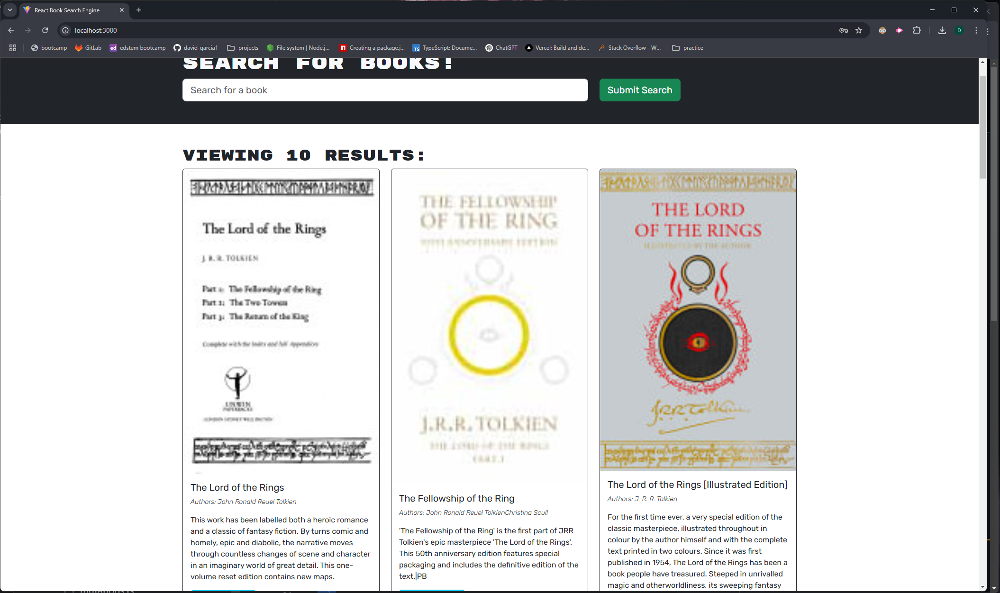
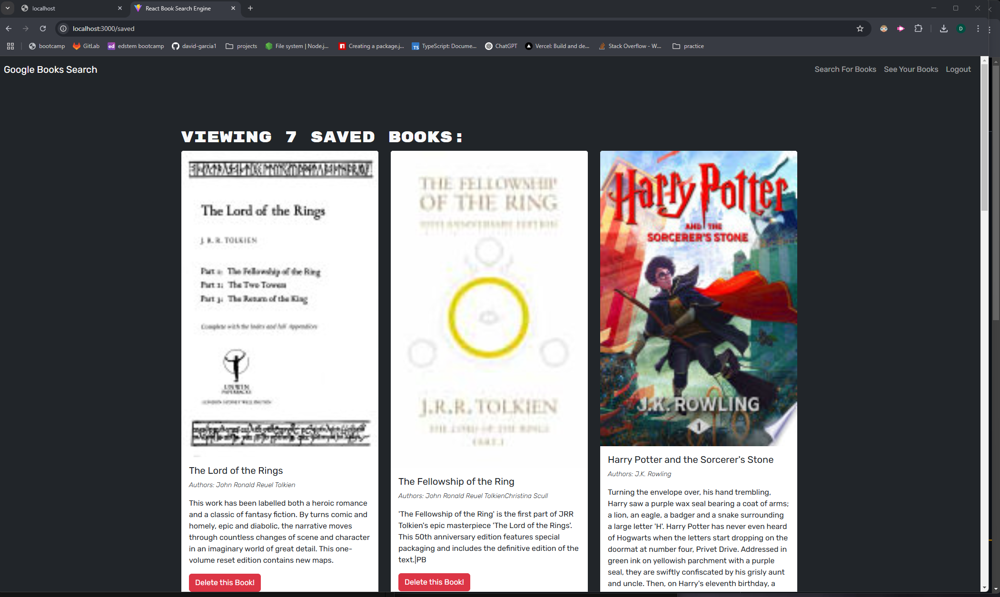

# Book Finder App

## Description

Book Finder App is a full-stack web application that allows users to search for books, create an account, log in, and save their favorite books. The front end is built using React, and the backend leverages ApolloDB for data management.

## Features

- **Search for books** using an external API (e.g., Google Books API)
- **User authentication** (signup, login, logout)
- **Save books** to a personal list
- **View saved books** in the user dashboard

## Technologies Used

### Frontend

- React
- Apollo Client
- GraphQL
- React Router
- Tailwind CSS (optional for styling)

### Backend

- ApolloDB
- GraphQL
- Node.js
- Express.js
- JSON Web Tokens (JWT) for authentication

